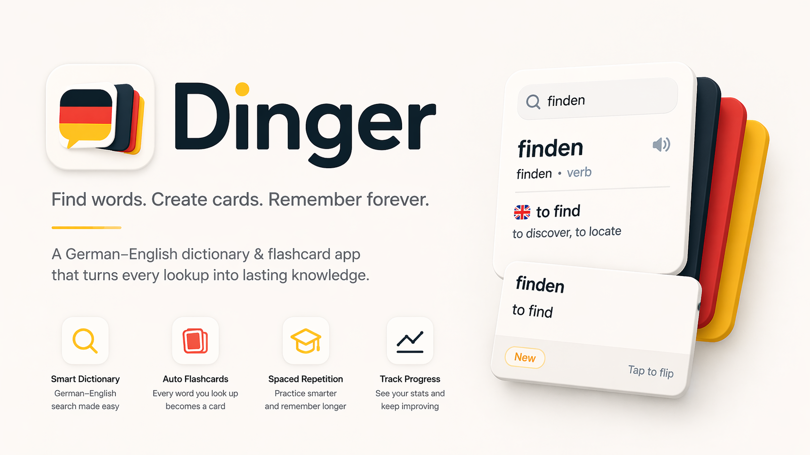

  

# Dinger

Dinger is a small SwiftUI German-English dictionary and study app with cards, quizzes, and spaced repetition.

The generated SQLite dictionary database is intentionally excluded from git. The source dictionary file in `resources/` is kept compressed as `.gz`.

## Credits

- Dictionary data: TU Chemnitz / BEOLINGUS German-English dictionary, Copyright (c) Frank Richter, 1995-2026, GPL Version 2 or later.
- Database layer: [GRDB.swift](https://github.com/groue/GRDB.swift), MIT License.
- Built with SwiftUI, Swift Package Manager, and Xcode.
