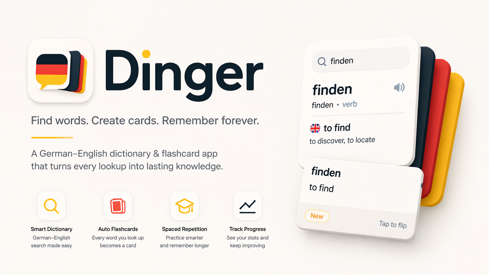

<p align="center">
  
</p>

# Dinger

Dinger is a German-English dictionary and study app with cards, quizzes, and spaced repetition. Its business logic is a platform-neutral Swift package used by the SwiftUI iOS app and the Jetpack Compose Android prototype.

Decks can be exported individually or backed up together from the Decks tab. Both formats include card selections, suspension state, the complete spaced-repetition schedule, and review history. The same import action accepts individual deck exports and all-decks backups.

The generated SQLite dictionary database is intentionally excluded from git. The source dictionary file in `resources/` is kept compressed as `.gz`.

## Tests

Run the shared business-logic and bridge tests:

```sh
cd Packages/DingerCore
swift test
```

Run the iOS app unit tests on an installed simulator:

```sh
xcodebuild -project Dinger.xcodeproj -scheme Dinger \
  -destination 'platform=iOS Simulator,name=iPhone 17,OS=26.5' \
  CODE_SIGNING_ALLOWED=NO test
```

Run the dictionary importer tests with `swift test` from `Tools/DictImporter`.

The Android app, setup, architecture, and emulator test commands are documented in [docs/android.md](docs/android.md).

## Credits

- Dictionary data: TU Chemnitz / BEOLINGUS German-English dictionary, Copyright (c) Frank Richter, 1995-2026, GPL Version 2 or later.
- Example sentences: [Tatoeba](https://tatoeba.org/) German-English sentence pairs, licensed under CC BY 2.0 FR.
- Database layer: [GRDB.swift](https://github.com/groue/GRDB.swift), MIT License.
- Built with SwiftUI, Jetpack Compose, Swift Package Manager, and the Swift SDK for Android.
